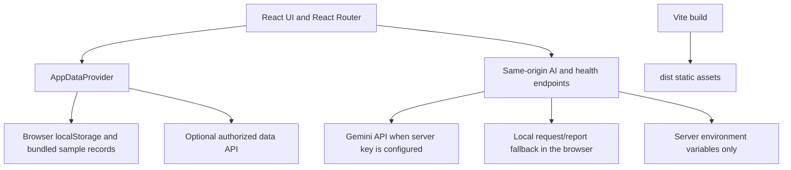

# JanSetu AI

JanSetu AI is a multilingual civic infrastructure dashboard built with React, TypeScript, and Vite. It provides a browser-local demo workflow for reviewing requests, projects, recommendations, and impact records. It is a prototype: it is not an official government service and its bundled sample data is illustrative, not a verified national dataset.

## Features

- Browse and search citizen requests; filter, sort, paginate, inspect details, update status, and export the current records.
- Create text and voice reports. Browser speech recognition is optional and depends on browser support and microphone permission.
- Analyze requests with Gemini through a server-side endpoint when `GEMINI_API_KEY` is configured; otherwise use a clearly labelled local rules-based demo analyzer.
- View sample hotspots and infrastructure gaps, generate recommendations with a transparent deterministic score from loaded records, and manage project lifecycle actions. Completed projects accept manually entered impact measurements; no outcome is invented.
- Generate filtered infrastructure briefings from the loaded aggregates. Reports use Gemini when available and local deterministic summaries otherwise; download text or use the browser's print-to-PDF flow.
- Choose mock, real, or hybrid data mode; the configured provider failure falls back to local records and is labelled in the interface.
- Set light, dark, or system appearance and choose the language used for request transcription and analysis. The surrounding dashboard labels are currently English.

## Architecture



The frontend is a Vite SPA, not a Next.js application. Vercel serves the built `dist/` directory, maps app routes back to `index.html`, and deploys the `api/` handlers as Node.js Functions. The local `npm run dev` and `npm start` commands use the same server-side API implementation.

## Run locally

Requirements: Node.js 24.x and npm.

```sh
npm ci
cp .env.example .env
npm run dev
```

Open the local URL printed by Vite. The dashboard works without credentials. Request and project changes are stored in this browser's local storage; they are not a shared database and clearing browser storage removes them.

For a production-like local static/API server:

```sh
npm run build
npm start
```

## Providers and environment

| Variable | Where it is used | Purpose |
| --- | --- | --- |
| `VITE_DATA_MODE` | Browser build | Initial data mode: `mock`, `real`, or `hybrid`. |
| `VITE_DATA_API_URL` | Browser build | Optional base URL for an authorized, compatible `GET /jansetu/data` endpoint. This URL is public. Do not put secrets in it. |
| `GEMINI_API_KEY` | Server only | Optional Gemini credential. Never prefix this with `VITE_`. |
| `GEMINI_MODEL` | Server only | Gemini model name; defaults to `gemini-2.0-flash`. |
| `PORT` | Local server | Optional local HTTP port; defaults to `4173`. |

In `mock` mode, bundled records are used. In `real` and `hybrid`, the app attempts the configured data URL and keeps the UI usable with local fallback records if the setting is absent or the request fails. The current data contract is a JSON object containing optional `complaints`, `projects`, and `recommendations` arrays. Other dashboards (including gaps, hotspots, and impact) currently use bundled illustrative records; a provider response does not make those records authoritative.

Request text and photos are sent to the same-origin AI endpoint only when a user submits analysis. Gemini processing occurs only if the server environment has a key. Without it, the client receives no secret and uses local rules; photo interpretation is not available in that fallback. Do not submit sensitive personal information to an untrusted deployment. No authentication, durable server database, government data credentials, or production citizen-data controls are included.

## Deploy to Vercel

1. Import the private GitHub repository into the intended Vercel account, or deploy from an authenticated local Vercel CLI.
2. Keep the framework preset as **Vite**, build command `npm run build`, and output directory `dist` (also declared in `vercel.json`).
3. Set `GEMINI_API_KEY` and optionally `GEMINI_MODEL` in Vercel's server environment settings if live Gemini is wanted. Do not add the secret as a `VITE_` variable or commit it. Rebuild/redeploy after changing environment settings.
4. Set `VITE_DATA_MODE` and `VITE_DATA_API_URL` only when an authorized compatible provider is available; these values are embedded in the public browser build.
5. Deploy and verify `/dashboard`, `/requests`, `/reports`, `/api/health`, and a POST to `/api/ai/analyze`. With no Gemini key, health reports the configuration status and AI endpoints return a controlled unavailable response; the UI falls back locally.

Deep-link rewrites and basic security headers are in `vercel.json`. For other hosts, configure the equivalent SPA fallback for the listed app routes and route `/api/*` to a compatible Node server. The standalone `npm start` server is not a replacement for authentication or an authorized production data service.

## Checks

```sh
npm run typecheck
npm run lint
npm test
npm run build
```

Run `npm run dev` and verify direct page refreshes and browser back/forward navigation after UI changes. Automated server API contract tests use Node's built-in test runner and require no external service credentials.

## Responsible use

This is a demonstration and planning aid, not a public authority, emergency reporting service, official grievance portal, or source of verified infrastructure allocations. AI output, local classifications, locations, beneficiary estimates, and bundled sample metrics require human validation. Do not treat them as audited evidence or policy recommendations.
